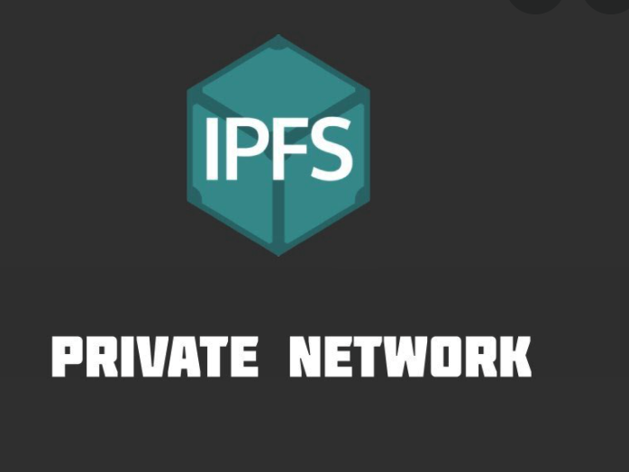

# IPFS - Private Network

<b>Inter Planetary File System</b> is a distributed network system for the IPFS connects your machine to the global distributed network. In some cases (privacy, confidentiality) a private IPFS network is preferred over connecting to the public IPFS network.

No connection to the public network will be made, so all the data on this private network will only be accessible to known peers on the network.